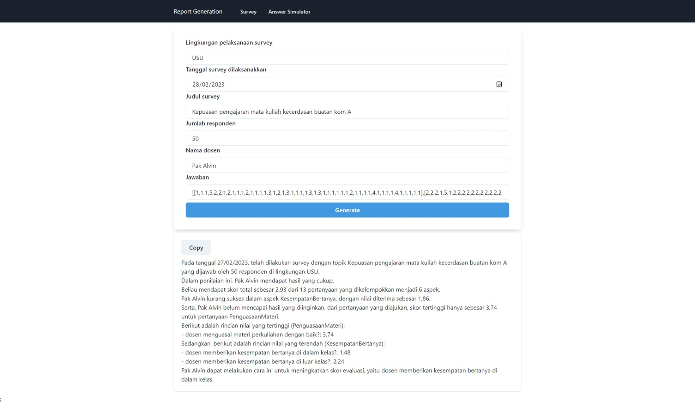
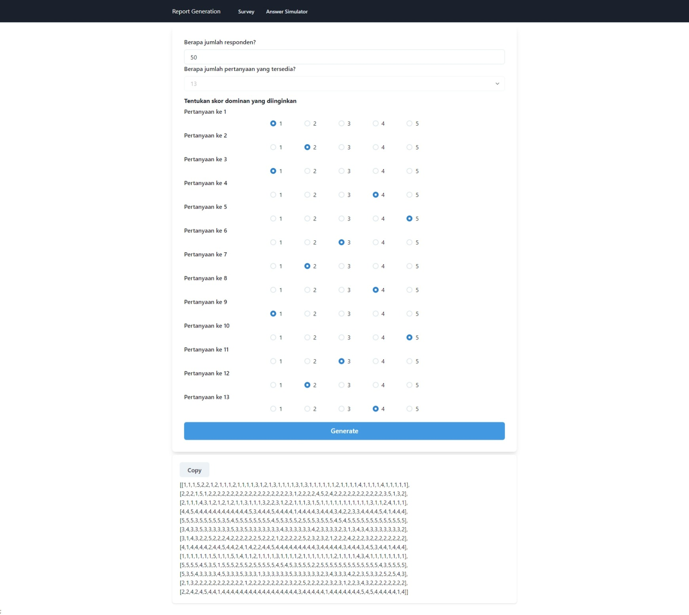

# Survey Report Generation (Frontend)

## Installation

- Clone repository ini
  ```bash
  git clone https://github.com/alvinfebriando/questionnaire-react
  ```
- Install nodejs dari link [ini](https://nodejs.org/en/download/)
- Jalankan program [backend](https://github.com/alvinfebriando/questionnaire-dotnet) nya

## Usage

- Melalui npm
  ```bash
  npm run dev
  ```

## Page

Terdapat 2 halaman yang bisa digunakan yaitu

- `/survey` untuk mengisi data dan menerima laporan yang dihasilkan
  
- `/simulator` untuk mendapatkan simulasi jawaban
  
